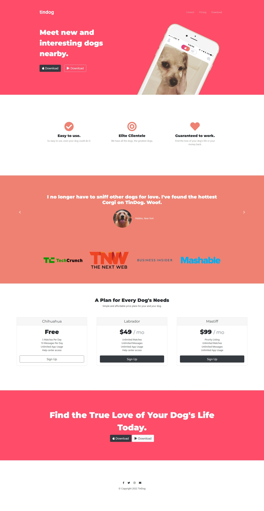

# Tindog
Tinder Clone website for Dogs made in HTML, CSS, Bootstrap.</br> It was part of this Course on [Udemy](https://www.udemy.com/) - [The Complete 2022 Web Development Bootcamp](https://www.udemy.com/course/the-complete-web-development-bootcamp/) Course by Dr. Angela Yu.

## About The Project
- A Simple Web Application using HTML, CSS, JavaScript & BootStrap
- Responsive on (Mobile as well as Desktop) Devices.
- Dogs love it Wuf Wuf.

## Tools & Languages
<a target="_blank" href="https://www.w3schools.com/html/default.asp"></img></a>
<a target="_blank" href="https://www.w3schools.com/css/default.asp"></img></a>
<a target="_blank" href="https://getbootstrap.com"> </img></a>
<a target="_blank" href="https://fontawesome.com/"> </img></a>


## Screenshots


## How to use Project

- Download or clone the repository Website : 
```
https://github.com/ManthanUgemuge/Tindog.git

```
Run Directly - [**Live**](https://manthanugemuge.github.io/Tindog/) //
[**Download**](https://github.com/ManthanUgemuge/Tindog/archive/refs/heads/main.zip)

## Contributing
Pull requests are welcome, feel free to ```fork``` this repo.

## License
This project is open-sourced under the [MIT license]().
